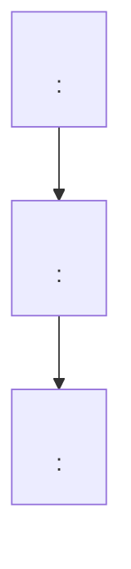

# Linux Analyze Log (image / file / inline string)

Given a Linux log supplied as an **image**, a **log file path**, or an **inline string / single line** in the chat, transcribe (or read) it, then locate every referenced symbol in the user's **local source tree**, open the matching code, and analyze the code flow (callers + callees) to propose a root cause.

## When to Use This Skill

Activate when **any** of the following appear:

- The user pastes / drops an **image** (PNG / JPG / clipboard screenshot) showing a Linux log.
- The user gives a **path to a local log file** (`.log`, `.txt`, `dmesg.out`, `journal-*.txt`, kdump `vmcore-dmesg.txt`, etc.) and asks to analyze it.
- The user pastes **one or more raw log lines as text** in the chat — even a single line like `WARNING: CPU: 3 PID: 0 at drivers/acpi/acpica/nsprepkg.c:94 acpi_ns_check_package+0x...` or `BUG: unable to handle page fault for address: ...`.
- The user explicitly asks to "analyze this screenshot / picture / file / line of a kernel log / call trace / dmesg".
- The user wants a code-flow / caller-callee walkthrough starting from any of the above.

Do **not** activate for BIOS firmware logs (use `bios-analyze-log` instead) or for generic application-only logs that have no kernel/driver/ACPICA symbol to resolve in a source tree.

## Hard Rules

1. **When in doubt, ask — never guess.** This rule overrides everything else in this skill. If *anything at all* is uncertain — input modality, which log to analyze, source tree path, kernel version, symbol disambiguation, file/line resolution, unreadable characters, truncated lines, ambiguous user intent, conflicting information, or any missing piece needed to proceed — **STOP immediately** and ask the user via `vscode_askQuestions` before taking the next action. Do not "make a reasonable assumption", do not "proceed with the most likely interpretation", do not pick one option silently. Ask first.
2. **Never guess on log content.** If anything is unreadable in the image, missing from the supplied text, ambiguous in the file, the source path is unknown, a symbol has multiple matches, or a stack frame can't be resolved → STOP and ask the user via `vscode_askQuestions`.
3. **Never fabricate** function names, file paths, line numbers, offsets, or addresses. Every claim must be backed by either a visible pixel in the image, a literal substring of the supplied text/file, or a real hit in the source tree.
4. **Do not modify** any source file or log file. This skill is strictly read-only.
5. **Online lookup of Linux kernel source / git is allowed.** When the user's local source tree lacks a symbol, or to cross-check upstream code, you may consult public Linux kernel sources (e.g. `git.kernel.org`, `elixir.bootlin.com`, `lore.kernel.org`, GitHub mirrors of `torvalds/linux`). Always label such citations as `upstream:` and include the commit/tag/version. Prefer the user's local tree first; online results never override local file:line evidence.
6. **Step 4 is non-skippable in `debug-a-failure` mode.** Once Step 3 (Branch D **or** Branch S) has emitted its closing summary line in `debug-a-failure` mode, the very next workflow action in the same reply MUST be `### Step 4 — Round 1` followed by `## Hypothesis`. The agent MUST NOT: (a) jump straight to a final root-cause conclusion / write-up, (b) emit any "final answer" / "resolution" / "recommendation" prose, (c) ask the user whether to *do* Step 4 (Step 5 is the only place that gates further rounds — Round 1 is mandatory, never opt-in), or (d) close the turn with only Step 3 deliverables. Skipping Step 4 in debug mode = skill violation; if the user *explicitly* says "skip experiment" / "don't do step 4" / "just give me the answer", the agent MUST first emit `Step 4 skip requested by user — workflow aborted; no root-cause conclusion will be issued without experimental evidence.` and stop. The agent is forbidden from offering a conclusion as a substitute for Step 4. The only legitimate way to bypass Step 4 is for the user to switch the run into `learn-the-code-path` mode (which then emits `Experiment skipped (learn mode).` per Step 4's own rule).
7. **Output language — English narrative + English code/format**: Narrative, explanations, hypotheses, walkthroughs, and questions to the user (including `vscode_askQuestions` `question` / `message` text) are written in English by default. The following MUST remain in English exactly as specified by this skill, with no translation:
   - Section headings (`## Transcribed Log`, `## Symbol Resolution`, `## Code Flow`, `## Conclusion`, and all sub-headers like `##### Callees of …`).
   - Table column names (`Frame (verbatim)`, `Definition file:line`, `Resolution method`, `Strength`, `When it runs`, etc.).
   - Enum values in any cell (`resolved`, `ambiguous-asked`, `direct-evidence`, `boot-once`, `syscall-entry`, `depth-3-cap`, `pr_info`, `grep:def-regex`, `on-path`, `direct`, `indirect-fnptr`, …).
   - Fixed-format summary lines (`Resolved N/M frames (K asked, L unresolved).`, `Expansion: depth=…, stop-reason=…`, `Verdict: top=…, confidence=…, evidence-rows=…, asked-followup=…`, `Walkthrough complete: anchors=…, notes=…, related=…`, `Notes: none.`, `Auto-opened K file(s) in editor tabs.`, `Auto-open skipped: no resolved rows.`, `Auto-open unavailable: run_vscode_command not enabled in this session.`).
   - The literal prefix `note (not observed here):` for learning-mode notes.
   - Code, file paths, symbol names, markdown links, and the verbatim transcribed log content (never translate the log).
   Free-form cells (`Claim`, `Mechanism`, `Action`, `Missing info`, `Why it discriminates…`, `Topic`, `Discrepancy noted?` reasons) and prose sections (`What This Code Does`, root-cause descriptions) are written in English. If the user explicitly requests another language, follow the user's request instead.

## Workflow

Follow these steps **in order**.

### Step 0 — Confirm the source tree FIRST (before reading anything else)

This is the very first action. Do **not** call `view_image`, `read_file` on a log, or analyze any inline text until the source mode (local tree or online upstream) is decided.

Ask the user once — do not reuse a path from earlier in the session unless the user re-confirms it.

```
vscode_askQuestions(questions: [{
  header: "source-tree",
  question: "Where is the Linux source code I should search? (I'll confirm this before touching the log.)",
  message: "Provide an absolute path to a local kernel / driver source tree (e.g. D:\\linux-6.6, /home/me/linux). Leave empty / answer 'online' / 'upstream' to use the latest upstream Linux source online (elixir.bootlin.com / git.kernel.org torvalds/linux master).",
  allowFreeformInput: true
}])
```

Validation procedure:

**Branch L — User supplies a local path** → set `source-mode = local` and run the local validation procedure:

1. `list_dir` the supplied path. If it doesn't exist → ask again.
2. Check it looks like a kernel/driver source tree: presence of at least one of `Makefile`, `MAINTAINERS`, `Kbuild`, `arch/`, `drivers/`, `kernel/`. If none → warn and ask again (the user may have given the wrong folder).
3. `read_file` the top of `Makefile` (first ≈10 lines) to capture `VERSION`/`PATCHLEVEL`/`SUBLEVEL`/`EXTRAVERSION`. Record this version triple — it must appear in the `Classification` section later.
4. Note the **absolute path** the user gave; this is the only local directory you may pass to `grep_search`/`file_search` via `includePattern`. Do not silently broaden the search to the workspace.

**Branch O — User did NOT supply a path (empty answer / "online" / "upstream" / "skip" / "use latest")** → set `source-mode = online-upstream` and fall back to online upstream. Do **not** keep re-asking; proceed.

1. Use the **latest** upstream Linux source (default: `torvalds/linux` `master` HEAD via `elixir.bootlin.com` and `git.kernel.org`). Do not silently pick a stable LTS branch unless the user asked for one.
2. Resolve the current upstream version tag by `fetch_webpage` on `https://www.kernel.org/` (mainline release line) and record the tag, e.g. `v6.10-rc3`. This tag replaces the Makefile triple in the `Classification` section.
3. All file/line links in later steps must point at the upstream view, e.g. `https://elixir.bootlin.com/linux/<tag>/source/<path>#L<line>` (or the equivalent `git.kernel.org` cgit URL). Mark every such citation with the `upstream:` label per Hard Rule 5.
4. `read_file` cannot be used on URLs. Use `fetch_webpage` against Elixir / cgit raw views to "open the code window" (≈ ±30 lines around the target line). A successful `fetch_webpage` that returns the exact target line counts as the equivalent of `read_file` for the Step 4 / Step 5 validations.
5. `vscode_listCodeUsages` and `grep_search` will not work online. For symbol/caller discovery use Elixir's identifier search (`https://elixir.bootlin.com/linux/<tag>/ident/<symbol>`) and source search via `fetch_webpage`. Record `Resolution method = elixir-ident` / `Discovery method = elixir-ident` (allowed as an extra enum value **only** in `source-mode = online-upstream`).
6. Step 4.5 (auto-open in editor) is **skipped** in this branch — emit exactly: `Auto-open skipped: source-mode=online-upstream (no local files).`

Only after Step 0 succeeds (either branch), proceed to Step 1.

### Step 1 — Ingest the log (pick the branch matching the input)

Determine the input modality first. Multiple inputs are allowed (e.g. image + inline note); process each and concatenate into the `Transcribed Log` section, labeled by source.

**Branch A — Image (PNG / JPG / clipboard screenshot)**
- Call `view_image` on every attached image. Copilot's multimodal vision reads the text directly — no OCR script is needed.
- Transcribe verbatim into a fenced code block.
- Any illegible line/character → mark `<unreadable>` and ask the user to retype it. Do **not** infer.

**Branch B — Local log file (path supplied by user)**
- Validate the path with `list_dir` or `file_search`; if missing, ask the user.
- For small files (≲ 2000 lines) `read_file` the whole thing. For larger logs, first `grep_search` for the canonical kernel markers (`BUG:`, `Oops:`, `RIP:`, `Call Trace:`, `WARNING: CPU:`, `general protection fault`, `Unable to handle`, `mce:`, `AER:`, `EDAC`, `watchdog:`, `------------\[ cut here \]------------`) to locate hits, then `read_file` a window of ≈20 lines around each hit.
- Quote the **exact excerpt** that was read into the `Transcribed Log` section, with the file path and line range, e.g. `--- from /var/log/dmesg.txt L412–L438 ---`.
- If the file has multiple unrelated traces, ask the user which one to analyze — do not pick one silently.

**Branch C — Inline string / single line in the chat message**
- Copy the user's text verbatim into `Transcribed Log` (no rewriting, no normalization of whitespace).
- If the line is clearly truncated (ends with `…`, `...`, missing offset, or only a partial `func+0x`) → ask the user for the full line before proceeding. Do **not** invent the missing bytes.
- A bare symbol name (e.g. just `acpi_ns_check_package`) with no offset / file / line is acceptable; treat the resolution step as a pure symbol lookup and skip the offset-to-line approximation.

After Step 1, the `Transcribed Log` section of your reply must be non-empty and labeled with the source modality (`image` / `file: <path>` / `inline`).

### Step 2 — Classify the log

Pick exactly one **primary category** from the simplified set below (and note secondary signals if useful):

| Category | Typical markers | Default intent |
|---|---|---|
| `kernel` | Core kernel paths: `BUG:`, `Oops:`, `panic`, `RIP:`, `Call Trace:`, `WARNING: CPU:`, `general protection fault`, `soft lockup`, `watchdog:`, `------------[ cut here ]------------`, symbols under `kernel/`, `mm/`, `fs/`, `net/`, `sched/`. | debug a failure |
| `tool` | Userspace / tooling output: `systemd[1]:`, unit names, `Started/Stopped …`, `Failed to start …`, `journalctl`, package managers, init scripts. | learn or debug (per severity) |
| `device` | Driver / device-driver subsystem messages: module tag like `[pcieport]`, `[nvme]`, `[i915]`, `[xhci_hcd]`, `probe failed`, `link up/down`, symbols under `drivers/`. | debug or learn |
| `hardware` | Hardware-error reports surfaced by the kernel: `mce:`, `MCE:`, `EDAC`, `AER:` (Correctable/Non-fatal/Fatal), CPU MCA banks, PCIe BDF + status, thermal/throttle events. | debug a failure |
| `firmware` | ACPI / BIOS / EFI / SMM-originated messages: `ACPI BIOS Error`, `ACPI Error`, `ACPI Warning`, `ACPI:` table parsing, `efi:`, `DMI:`, `SMBIOS:`, ACPI paths like `\_SB.SCK0.C000._PSS`. | debug or learn |

Tie-breaking when multiple categories match: prefer the **deepest layer** present — `firmware` > `hardware` > `device` > `kernel` > `tool` (a `mce:` line that also triggers a kernel oops is still primarily `hardware`; an `ACPI BIOS Error` raised inside ACPICA is `firmware`). Record any secondary categories on a separate line.

### Step 3 — Branch by intent: community search (debug) or source-module map (source-read)

**Purpose**: Step 3 splits into two mutually exclusive branches based on user intent. Either branch produces a self-contained deliverable that Step 4 can build on.

- **Branch D — debug** (default for `debug-a-failure` mode): sweep the upstream Linux community for similar reports, write `similar.md` with 1–3 verifiable cases. This is the original Step 3 flow (sub-sections 3.1 – 3.6 + Hard validations below). All existing `debug-a-failure` work goes here.
- **Branch S — source read** (new): no failure to chase — the user wants to understand which kernel/driver modules the log touches and how they call each other. Produce a module list + a call-graph (≤ 3 levels deep). No web search. No `similar.md`.

#### 3.0 Pick the Step 3 branch

Decide the branch from Step 2 intent + an explicit ask:

- If Step 2 intent is **`debug-a-failure`** → default branch = **D**.
- If Step 2 intent is **`learn-the-code-path`** → default branch = **S**.
- Always confirm with the user once before proceeding (cannot be skipped):

```
vscode_askQuestions(questions: [{
  header: "step3-branch",
  question: "Which Step 3 branch should I run?",
  message: "D = search the Linux community online for similar cases and produce similar.md (suitable for debug). S = no web search; just list the source modules touched by the log + a ≤3-level call graph (suitable for code reading / learn).",
  options: [
    { label: "D — debug (community search → similar.md)", recommended: <true if intent=debug else false> },
    { label: "S — source read (module map + call graph ≤ 3 levels)", recommended: <true if intent=learn else false> }
  ],
  allowFreeformInput: true
}])
```

Record the chosen branch verbatim on a single line: `Step 3 branch: D` or `Step 3 branch: S`. The two branches are mutually exclusive — never run both in the same Step 3 turn.

---

## Branch D — debug (community search → `similar.md`)

Run this branch only when `Step 3 branch: D`. The deliverable is a new file `similar.md` listing 1–3 most relevant Linux-community cases with verifiable links.

In `learn-the-code-path` mode that nonetheless picked Branch D, treat the community sweep as optional — ask the user once whether they still want it; if no, emit `Community search skipped (learn mode).` and proceed to Step 4.

#### 3.1 Confirm the output path

Before any web fetch, ask the user once where `similar.md` should be written:

```
vscode_askQuestions(questions: [{
  header: "similar-md-path",
  question: "Where should similar.md (community similar cases) be written?",
  message: "Default = ./similar.md at the workspace root. Provide an absolute path to override; answer 'default' to use the default path. If the target file already exists, I will stop and ask whether to overwrite.",
  allowFreeformInput: true
}])
```

Resolution rules:
- `default` / empty answer → workspace root `./similar.md`.
- User-supplied absolute path → use it (must end in `.md`, otherwise ask again).
- If the target file already exists → a follow-up `vscode_askQuestions` with two options: `Overwrite` / `Append a new section with timestamp header`. Silent overwrite is not allowed.
- Writing inside the source tree root (Step 0 Branch L path) is forbidden, to avoid polluting the source. If the user-supplied path falls inside the source tree, warn and ask again.

#### 3.2 Build queries from the Transcribed Log

Pick **1–3 stable, distinctive substrings** from `## Transcribed Log` and quote them verbatim in backticks. Hard rules for query construction:

- Strip runtime-variable tokens: addresses (`ffff…`), PIDs, CPU#, timestamps, BDFs with concrete numbers (use the canonical `[Bus:Dev.Fn]` shape only if it's a known model), task names, hex offsets after `+0x…`.
- Keep stable anchors: error class (`BUG:`, `WARNING:`, `general protection fault`, `mce: [Hardware Error]:`, `AER: …`), the **symbol name without offset**, the **format-string fragment** (e.g. `"acpi_ns_check_package: Return Package type mismatch"`), Kconfig token, subsystem tag (`[pcieport]`, `[nvme]`).
- Every query MUST be a literal substring of `## Transcribed Log` after the strip step. Do not paraphrase. Do not invent symbol names.
- Minimum 1 query, maximum 3.

#### 3.3 Search scope — Linux community only

Allowed sources (use `fetch_webpage` against each site's search endpoint):

| Source | Search URL pattern | Priority |
|---|---|---|
| `lore.kernel.org` | `https://lore.kernel.org/all/?q=<query>` | 1 (highest) |
| `bugzilla.kernel.org` | `https://bugzilla.kernel.org/buglist.cgi?quicksearch=<query>` | 2 |
| `git.kernel.org` (commit search) | `https://git.kernel.org/pub/scm/linux/kernel/git/torvalds/linux.git/log/?qt=grep&q=<query>` | 2 |
| `bugzilla.redhat.com` | `https://bugzilla.redhat.com/buglist.cgi?quicksearch=<query>` | 3 |
| `bugs.debian.org` | `https://bugs.debian.org/cgi-bin/pkgreport.cgi?include=subject:<query>` | 3 |
| `bugs.launchpad.net` | `https://bugs.launchpad.net/ubuntu/+bugs?field.searchtext=<query>` | 3 |
| `gitlab.freedesktop.org` | `https://gitlab.freedesktop.org/search?search=<query>` | 3 (DRM/Mesa only) |

**Forbidden**: StackOverflow, Reddit, personal blogs, Medium, vendor support pages, ServerFault, LinuxQuestions, generic Google. If the user explicitly requests a non-community source, ask once and record `Source = other:<host>` in the table.

#### 3.4 Pick and verify hits

1. Run `fetch_webpage` on each query × source combination, starting from priority 1.
2. Stop as soon as you have **3 candidates** OR exhausted all queries × top-2 sources, whichever comes first.
3. For every candidate URL: `fetch_webpage` the URL itself and verify the page actually contains the query substring **and** at least one of the Step 2 extracted anchors (symbol name / format-string fragment / error class). Drop any hit that fails this check.
4. Rank surviving hits by `Relevance` enum below. Keep top 1–3.

`Relevance` enum (English, exact strings):
- `same-error` — same panic/oops/WARNING text and same top symbol.
- `same-symbol` — same symbol involved, different surrounding error.
- `same-subsystem` — same driver/subsystem, different symbol.
- `patch-fix` — a commit/patch that explicitly fixes the same log line.
- `discussion-only` — thread about the same log without resolution.

If after all searches no hit survives verification → emit `Community hits: none found across <N> queries.` and write `similar.md` with the placeholder block defined in 3.5; do not fabricate hits.

#### 3.5 Write `similar.md`

Write the file at the path confirmed in 3.1. Required structure (English headings, table columns, and enums; free-form summary cells in English):

```markdown
# Similar Linux community cases

Generated: <ISO-8601 timestamp>
Source log: <image | file:<path> | inline>
Category (Step 2): <kernel | tool | device | hardware | firmware>

## Queries used

| # | Query | Verbatim from log? |
|---|---|---|
| 1 | `<query string>` | yes |
| … | … | … |

## Hits

| # | Source | Title / Thread | Link | Date | Relevance | One-line summary |
|---|---|---|---|---|---|---|
| 1 | `lore.kernel.org` | `<thread subject>` | <URL> | YYYY-MM-DD | `same-error` | <≤25 chars> |
| … | … | … | … | … | … | … |

## Notes

- <one sentence: the most important thing these cases have in common with the current log>
- <if a patch-fix hit, call out the commit hash and the Fixes: tag>
- <if no hits, list every query and source attempted, for review>
```

If no hits survived 3.4, the `## Hits` table contains exactly one row:

```
| - | - | No verified community match | - | - | - | searched <N> queries × <M> sites, no verifiable hits |
```

#### 3.6 Echo into the chat reply

In the main chat reply, emit a `## Community Hits` summary section that mirrors the `## Hits` table from `similar.md` (same columns, same rows) plus exactly one of these three fixed summary lines:

- `Community hits: <K> written to <path> (queries=<N>, verified=<K>).`
- `Community hits: none found across <N> queries. similar.md written to <path>.`
- `Community search skipped (learn mode).`

#### Hard validations for Step 3

1. `similar.md` MUST be written (or skipped via the learn-mode exception); failing the write = Step 3 incomplete.
2. Every URL in `## Hits` MUST have been confirmed with `fetch_webpage` **this turn** to contain the query substring + a Step 2 anchor. URLs from memory / training are not allowed.
3. Maximum 3 hits. No "honorable mentions". No hits that failed verification.
4. Community hits MAY be cited later as background context but MUST NOT serve as primary evidence for any future root-cause claim — file:line in the source tree (Step 4+) is the only acceptable evidence.
5. Output path MUST come from the user (3.1); never invent a path. Never write inside the source tree given in Step 0 Branch L.
6. **Step 3 → Step 4 transition is mandatory in `debug-a-failure` mode.** After emitting the Step 3 closing summary (`Community hits: …` / `Community search skipped (learn mode).`), if the active mode is `debug-a-failure`, the very next section in the reply MUST be `### Step 4 — Round 1` → `## Hypothesis`. No conclusion, no "final root cause", no recommendations, no `vscode_askQuestions` asking whether to run Step 4 may appear between Step 3's closing line and Step 4.1. Reordering / omitting Step 4 = Step 3 turn invalid even if `similar.md` was written correctly. (See Hard Rule 6.)

---

## Branch S — source read (module map + call graph, no web search)

Run this branch only when `Step 3 branch: S`. The deliverable is a single `## Source Module Map` section in the chat reply — **no file is written**, no community sweep, no hypothesis. This branch typically feeds a `learn-the-code-path` Step 4 (which itself is skipped — emit `Experiment skipped (learn mode).` later), so it must stand on its own as the substantive answer.

#### S.1 Anchor symbols (input to the module map)

Collect the anchor symbols from prior steps. Hard rules:

1. Use only symbols already present in `## Transcribed Log` (Step 1) or already extracted in Step 2 (`Print / crash site`, `Stack frames`, subsystem tag, ACPI path, MCE bank name, AER source ID). No new symbols invented here.
2. Strip `+0x<offset>`, `<addr>`, and module-prefix `[modname]` before resolving.
3. Maximum **5 anchors**. If the log has more, ask the user via `vscode_askQuestions(header: "step3s-anchors")` to pick which 5; do not silently truncate.
4. Each anchor must resolve to a real `file:line` in the source tree (Step 0 Branch L `grep_search` / `file_search`, or Branch O `elixir-ident` via `fetch_webpage`). Unresolvable anchors are dropped and noted as `<unresolved>` in the table — never faked.

#### S.2 Module classification

Map each anchor to its owning **module** using its definition path. Module = the top-level directory segment plus the immediate sub-area, e.g. `drivers/nvme/host`, `drivers/pci/pcie/aer`, `fs/ext4`, `mm/page_alloc`, `kernel/sched`, `arch/x86/kernel/cpu/mce`, `drivers/acpi/acpica`. Do not invent module names.

For each unique module, also record:

- `Role` enum (exact strings, one per row): `entry` (where the log line is emitted or the trap is taken), `core` (subsystem internals on the path), `helper` (utility / library called by core), `hw-abstraction` (PCI/ACPI/MMIO/MSR shim), `policy` (sysctl / Kconfig / sysfs knob handlers touched on the path), `unrelated-but-on-trace` (appeared in stack but does no real work for this log).
- One-sentence purpose in English (≤ 30 chars).

Emit `## Source Module Map` table first:

| # | Module | Role | One-line purpose | Anchor symbols in this module |
|---|---|---|---|---|
| 1 | `<module>` | `core` | <≤30 chars> | `sym_a`, `sym_b` |
| … | … | … | … | … |

Rules:
- 1–6 rows. If the natural answer exceeds 6, collapse `helper` / `unrelated-but-on-trace` rows into one labeled `misc (<N> modules)` rather than padding.
- Same module never appears twice; merge anchors into one row.

#### S.3 Call graph (≤ 3 levels deep, no cycles)

Build a directed call graph rooted at the **entry anchor** (the symbol that emitted the log line; for crashes use the top stack frame). Hard rules:

1. **Maximum depth = 3** (root = depth 0; deepest leaf = depth 3). Hard cap; never expand to depth 4 even "just to show one more interesting call". If the truthful depth would exceed 3, stop and emit `Truncated at depth 3 (further callees omitted).` as a trailing note.
2. **Direction = callees only** (root calls child, child calls grandchild). Caller chains are not part of Branch S; if the user wants them, that is a follow-up turn.
3. **Fan-out cap per node = 3** most-relevant children. "Most relevant" = on the path that produced the log line, or referenced by the anchor symbols in S.2. If more exist, append `… (+K more)` literally in the child cell.
4. **No cycles.** If a child re-enters an ancestor, render it as `<sym> (cycle → depth <D>)` and stop expanding that branch.
5. **Every edge must be backed by a real call site** found via `grep_search` (Branch L) / `elixir-ident` `fetch_webpage` (Branch O). Include the call-site `file:line` in the table — no edge from memory / inference.
6. **Indirect calls** (function pointers, ops tables, notifier chains) are allowed but must be marked with `Edge = indirect-fnptr` and the ops-table symbol named (e.g. `via nvme_ctrl_ops.submit_async_event`). Direct calls use `Edge = direct`.

Render the graph as both a Mermaid block AND a flat edge table.



And the edge table (single source of truth — Mermaid is a convenience render):

| Depth | From symbol | To symbol | Edge | Call site `file:line` | Note |
|---|---|---|---|---|---|
| 0→1 | `<root>` | `<child>` | `direct` | `drivers/foo/bar.c:123` | <≤20 chars or blank> |
| 1→2 | `<child>` | `<grandchild>` | `indirect-fnptr` | `drivers/foo/baz.c:88` | `via foo_ops.submit` |
| … | … | … | … | … | … |

Rules for the table:
- Sorted by `Depth` ascending, then by `From symbol` alphabetically.
- Every `Call site file:line` must be a path that exists (Branch L) or a real upstream Elixir URL (Branch O). No invented lines.
- The number of rows MUST equal the number of edges in the Mermaid block; mismatch = invalid.

#### S.4 Closing summary

Emit exactly one of these fixed lines:

- `Source-read complete: modules=<M>, anchors=<A>, edges=<E>, max-depth=<D≤3>.`
- `Source-read truncated at depth 3: modules=<M>, anchors=<A>, edges=<E>, omitted-branches=<K>.`
- `Source-read partial: modules=<M>, anchors=<A>, edges=<E>, unresolved-anchors=<U>.` (use when any anchor stayed `<unresolved>` in S.1)

#### Hard validations for Branch S

1. Exactly one `## Source Module Map` table, one Mermaid `flowchart TD` block, one edge table per Branch S turn. Missing any of the three = Branch S incomplete.
2. Mermaid edges and edge-table rows MUST match 1:1 (same `From → To` pairs, same count).
3. Tree depth in both renderings MUST be ≤ 3. Depth 4+ = violation, even with the `(+K more)` marker.
4. No file is written to disk in Branch S. If the user asks for a written artifact, that is a follow-up turn — do not silently write one here.
5. No community URLs, no `similar.md`, no `## Hits` table in Branch S output. Mixing Branch D artifacts into Branch S = violation.
6. Every `file:line` cited MUST be reachable via Step 0's source-mode tools this turn. Cite Branch O upstream URLs with the `upstream:` label per Hard Rule 5.

---

### Step 4 — One hypothesis + a step-by-step experiment (wait for user input at every step)

**Purpose**: based on Step 2 (`Category` + intent) and Step 3 (community hits or `none-found`), commit to **exactly ONE** root-cause hypothesis, then run a small experiment that **you do not execute** — the user runs each command on their own machine and pastes the output back. The skill must pause after every experiment step and wait for the user's verification.

This step is **mandatory in `debug-a-failure` mode and cannot be skipped, deferred, or replaced by a conclusion**. As soon as Step 3 emits its closing summary line in debug mode, Step 4.1 MUST start in the same reply — no "would you like me to run an experiment?" gate, no jumping to a root-cause write-up, no asking the user to confirm whether Step 4 should happen at all (Round 1 is mandatory; Step 5 only gates *additional* rounds). The agent MUST NOT issue a final root-cause conclusion in any turn that lacks a completed `## Experiment Log` table with at least one `support` or `refute` row. See Hard Rule 6 for the override path. In `learn-the-code-path` mode it is **skipped** — emit exactly `Experiment skipped (learn mode).` and stop Step 4 there.

#### 4.1 Form exactly one hypothesis

Emit a `## Hypothesis` section with these fixed fields (English keys, value language per Hard Rule 6):

| Field | Required content |
|---|---|
| `Claim` | One sentence: the single most likely root cause. |
| `Mechanism` | Short paragraph: how that cause would produce the exact log line(s) from `## Transcribed Log`. |
| `Predicts` | 1–3 concrete observable consequences that MUST be true if the claim holds (e.g. a counter increments, a sysfs node has value X, a second log line appears). |
| `Falsifiable by` | 1–3 concrete observable consequences whose presence would kill the claim. |
| `Confidence` | Enum: `low` / `medium` / `high`. |
| `Basis` | Bulleted: cite Step 2 `Category` + at least one Step 3 row (`row #N` from `## Hits`) **or** the literal token `community: none-found`. No other basis allowed. |

Hard rules for 4.1:
1. **Exactly one** hypothesis. Not two, not "or". If you can't pick one, ask the user via `vscode_askQuestions` to choose between two candidates before writing this section.
2. `Claim` must be falsifiable — if no realistic observation could disprove it, rewrite.
3. `Predicts` and `Falsifiable by` must be disjoint sets; an item in both = invalid.
4. Do not cite Step 4 / Step 5 / Step 6 here — they don't exist yet.

#### 4.2 Design the experiment (2–5 ordered steps, read-only by default)

Emit a `## Experiment Plan` table:

| # | Goal | Action (read-only command) | Expected if hypothesis TRUE | Expected if hypothesis FALSE | Verification input requested |
|---|---|---|---|---|---|
| 1 | <one short goal> | `<exact shell command>` | <verbatim string / regex / numeric range> | <verbatim string / regex / numeric range> | <what to paste back: full stdout, last N lines, specific field …> |
| … | … | … | … | … | … |

Rules for the plan:

1. **2–5 steps**. Fewer = not an experiment; more = split into a follow-up Step 4 invocation.
2. **Each step must be a single command the user can run on the affected machine**, with no chaining, no shell pipelines longer than 2 stages, and no destructive flags. Allowed verb set by default:
   - `dmesg` / `journalctl` (with `--since` / `-k` / `-u`)
   - `cat` / `head` / `tail` / `less` on `/proc/*`, `/sys/*`, `/var/log/*` (read-only)
   - `lspci -vvv`, `lsusb -v`, `lsmod`, `modinfo`, `lsblk`, `lscpu`, `dmidecode -t <type>`
   - `ethtool` (no `-s`/`--set-*`), `iw dev … link`, `nvme list`, `nvme smart-log` (read-only subcommands only)
   - `smartctl -a` / `-x` (no `-t`, no `--set`)
   - `perf stat` for short durations (≤ 10 s)
   - `cat /sys/kernel/debug/...` only if user pre-mounted debugfs; never `mount` for them.
3. **Forbidden by default**: `echo … > /sys/…`, `echo … > /proc/sys/…`, `sysctl -w`, `modprobe -r`/`insmod`/`rmmod`, `kexec`, `reboot`, `systemctl start/stop/restart`, `dd`, `mkfs`, `parted`, `setpci -s … w*`, `ip link set`, `iptables -[AID]`, `mount`, `umount`, any package install. If the hypothesis genuinely needs one of these, the step MUST be prefixed with `WRITE:` in column `Action` and require a separate explicit opt-in (see 4.3).
4. Every `Expected if TRUE/FALSE` cell MUST be a string the user can match by `grep -F` or eyeball — concrete tokens, fixed regexes, or numeric ranges. No "you should see something interesting".
5. Steps MUST be ordered cheapest-to-most-expensive (file reads → tool dumps → live captures). Stop the moment one step refutes.

#### 4.3 Execute the plan one step at a time — **wait at every step**

For each step `N` in order, run this exact loop:

1. Emit the sub-header `### Experiment Step <N> / <total> — <Goal>`.
2. Echo the exact command from the plan in a fenced code block.
3. Restate the `Expected if TRUE` and `Expected if FALSE` strings verbatim.
4. **Pause and ask via `vscode_askQuestions`**:
   ```
   vscode_askQuestions(questions: [{
     header: "exp-step-<N>",
     question: "Please run the command above on the affected machine and paste the output here (full stdout, or the specific field named in 'Verification input requested').",
     options: [
       { label: "Paste output", recommended: true },
       { label: "Skip this step (mark inconclusive)" },
       { label: "Abort experiment" }
     ],
     allowFreeformInput: true
   }])
   ```
   If the step is `WRITE:` (4.2 rule 3), add a second confirmation question `exp-step-<N>-write-consent` with options `Yes, run the write command` / `No, fall back to a read-only alternative` / `Abort`. The write command may only be echoed after `Yes`.
5. **Do not proceed to step `N+1` until the user has responded.** No speculative continuation, no "I'll assume the output looks like X".
6. Once the user pastes output (or chooses Skip/Abort), evaluate against the `Expected if TRUE / FALSE` strings literally:
   - Output matches `TRUE` predicate → `Result = support`.
   - Output matches `FALSE` predicate → `Result = refute`.
   - Output matches neither, or is ambiguous, or user chose Skip → `Result = inconclusive`.
   - User chose Abort → `Result = aborted`.
   `Result` enum is exactly these four strings.
7. Append one row to the running `## Experiment Log` table:

   | # | Step goal | User output excerpt (≤ 3 lines, verbatim, fenced) | Match against TRUE | Match against FALSE | Result |
   |---|---|---|---|---|---|

8. Decide whether to continue:
   - `refute` → **stop immediately**. Emit `Hypothesis status: REFUTED at step <N>.` Do **not** invent a replacement hypothesis in this turn; the user must start a new Step 4 round.
   - `aborted` → emit `Hypothesis status: ABORTED by user at step <N>.` and stop.
   - `support` or `inconclusive` → continue to step `N+1`.

#### 4.4 Closing summary

After the last step runs (or an early stop fires), emit exactly one of these fixed lines:

- `Hypothesis status: SUPPORTED (<S>/<T> steps support, <I> inconclusive, 0 refute).`
- `Hypothesis status: REFUTED at step <N>.`
- `Hypothesis status: INCONCLUSIVE (<S> support, <I> inconclusive, 0 refute across <T> steps).`
- `Hypothesis status: ABORTED by user at step <N>.`

`SUPPORTED` requires `S ≥ 1` and `0 refute`. `INCONCLUSIVE` is the catch-all if no support row was produced but no refute either.

#### Hard validations for Step 4

1. Exactly one `## Hypothesis` section, exactly one `## Experiment Plan` table, exactly one `## Experiment Log` table per Step 4 turn.
2. Number of rows in `## Experiment Log` MUST equal the number of steps actually executed (no "planned but not run" ghost rows; no "ran but not logged" steps).
3. Between emitting `### Experiment Step <N>` and writing its `## Experiment Log` row, there MUST be exactly one `vscode_askQuestions` call with header `exp-step-<N>` (plus the optional `exp-step-<N>-write-consent` for WRITE steps). Missing the wait = Step 4 violation.
4. Never paste fabricated command output into `## Experiment Log`. The "User output excerpt" cell MUST be verbatim from the user's reply, or the literal token `<skipped>` / `<aborted>`.
5. No new hypothesis may be created in the same turn after `REFUTED` / `ABORTED`. The user re-triggers Step 4 to try another.
6. **Round 1 is mandatory in `debug-a-failure` mode** (Hard Rule 6 + Step 3 validation 6). The reply that completes Step 3 MUST also start Step 4 Round 1 with a `## Hypothesis` section. A Step 3 reply that ends with a root-cause conclusion / final write-up / "recommendations" before any `## Experiment Log` row exists = automatic violation, regardless of how confident the conclusion looks. The agent MUST NOT use phrases like "based on the above we can conclude", "root cause is …", or "the issue is caused by …" in any turn whose `## Experiment Log` is empty or missing.

### Step 5 — Ask the user whether to run another round of Step 4

**Purpose**: Step 4 is gated by user time and machine access. After every Step 4 closing summary, **always** ask the user whether to run another round (a fresh hypothesis + experiment) before producing any final write-up. This is the only place the workflow may loop back to Step 4.

This step runs after every Step 4 closing line (`SUPPORTED` / `REFUTED` / `INCONCLUSIVE` / `ABORTED`) **and** when Step 4 was skipped via `Experiment skipped (learn mode).` — in the learn case, Step 5 still asks once whether the user wants to switch into debug mode and run a Step 4 round.

#### 5.1 Single mandatory question

Emit exactly one `vscode_askQuestions` call, header = `step4-next-round`. The option set is fixed and depends on the Step 4 status:

| Step 4 closing status | Recommended option | Other options |
|---|---|---|
| `SUPPORTED` | `No — proceed to final write-up` | `Yes — run another round with a refined / deeper hypothesis`, `Switch hypothesis to a different angle` |
| `REFUTED` | `Yes — try a different hypothesis` | `No — stop debugging here`, `Need more data first (collect logs, then come back)` |
| `INCONCLUSIVE` | `Yes — try a sharper experiment` | `No — stop here with inconclusive result`, `Switch hypothesis to a different angle` |
| `ABORTED` | (no recommendation) | `Yes — restart with a new hypothesis`, `No — stop here` |
| `Experiment skipped (learn mode)` | `No — stay in learn mode` | `Yes — switch to debug mode and run Step 4` |

Required call shape:

```
vscode_askQuestions(questions: [{
  header: "step4-next-round",
  question: "Step 4 has finished (<status>). Run another round of Step 4?",
  message: "Yes = go back to Step 4.1; I will produce a **different** new hypothesis + new experiment plan and wait for your step-by-step output. No = end the experiment phase and proceed to the final write-up.",
  options: [ <fill in the options for the corresponding row of the table above; fixed order: recommended item first, others in table order> ],
  allowFreeformInput: true
}])
```

Hard rules for 5.1:
1. **Exactly one** `vscode_askQuestions` call with header `step4-next-round` per Step 4 round. Asking twice in a row = violation.
2. The option labels MUST be the literal strings from the table above. Do not paraphrase, do not translate, do not add a fourth option.
3. Recommended option (`recommended: true`) MUST match the table; if the table says "no recommendation" (the `ABORTED` row), do not set `recommended` on any option.
4. Do not pre-empt the user — no "I'll go ahead and run another round" before the response arrives.

#### 5.2 Branch on the user's answer

After the user responds:

- **Yes (any "Yes — …" variant)** → emit the marker `### Step 4 — Round <N+1>` (where `<N>` is the round just finished, starting from 1) and loop back to Step 4.1. The new round MUST satisfy:
  1. `## Hypothesis.Claim` is **not** byte-identical to any previous round's `Claim` in this conversation. If you cannot construct a different claim, stop and tell the user (do not pad with synonyms).
  2. `Basis` must additionally cite the previous round's `Hypothesis status` line (e.g. `prior round: REFUTED at step 2`) alongside the Step 2 / Step 3 anchors required by 4.1.
  3. The new `## Experiment Plan` MUST contain at least one Action that is **not** present in any prior round's plan (no copy-paste re-runs).

- **No (any "No — …" variant)** → emit exactly one of these fixed closing lines and stop Step 5; the workflow proceeds to the final write-up (handled outside this skill section, or ends here if no later step exists):
  - `Step 4 closed by user: no further rounds (last status: <status>).`

- **`Need more data first (collect logs, then come back)`** (only valid after `REFUTED`) → emit:
  - `Step 4 paused: awaiting additional logs from user. Re-trigger this skill with the new logs to restart from Step 1.`
  - and stop. Do not auto-resume; the user must re-invoke.

- **`Switch hypothesis to a different angle`** → treat as `Yes`, but additionally require the new `Claim` to land in a **different Step 2 category branch** than the previous round (e.g. previous = `hardware`, new = `device` or `kernel`), unless the user explicitly overrides via freeform input.

- **`Switch to debug mode and run Step 4`** (only valid after `Experiment skipped (learn mode)`) → re-enter Step 4 from 4.1 as `Round 1`; the learn-mode `## What This Code Does` / `## Related Reading` sections (if any) stay above, untouched.

- **Freeform answer that doesn't match any option** → re-ask once with the same header `step4-next-round` and a short clarification message; do **not** guess intent.

#### Hard validations for Step 5

1. Step 5 MUST appear in the reply once per Step 4 round, immediately after the Step 4 closing summary line. No skipping. No running it before Step 4 completes.
2. The `vscode_askQuestions` header MUST be exactly `step4-next-round`. Reusing the header across rounds is required (one per round); using a different header for the same purpose is a violation.
3. If the user picks `Yes` / `Switch …`, the next `### Step 4 — Round <N+1>` header MUST appear in the same conversation turn that resumes work, and 5.2 rule "different Claim / different Action" MUST be enforced before the new `## Hypothesis` is written.
4. Never start a new Step 4 round without going through Step 5. A new round without a `step4-next-round` answer immediately preceding it is invalid.
5. After a `No — …` answer, do not re-ask Step 5 in the same turn even if the user later says "actually keep going" — that requires a new user message that re-triggers the skill.


